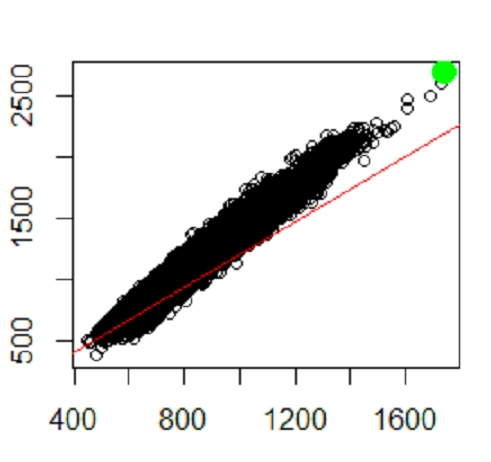

Bare Soil Line (16 Bit) Function for R
========================================

This is a Bare Soil Line function (BSL_16) that is used to calculate bare soil lines from 16 bit satellite images.  This function enhances the original landsat/BSL.R code written by S. Goslee (https://github.com/cran/landsat/blob/master/R/BSL.R) by processing 16 bit image values (e.g. image data from Landsat 8, Planet Labs, etc.). This program will generate a Bare Soil Line based on statistical parameters from a Model II regression. 

About the Bare Soil Line:
-------------------------

The bare soil line is a linear relationship between bare soil reflectances observed in two different wavelengths.  An example is the relationship between Near Infrared and Red wavelengths which can be used to show the boundary between the soil and vegetation pixels. The vegetation pixels will be above the soil line. The green dots represent the full canopy point (maximum vegetation). The bare soil line can also [estimate soil properties from remotely sensed images](https://naldc.nal.usda.gov/download/9394/PDF).

.

Steps to Run the Program:
-------------------------

* Download a Landsat 8 .tif format image from a [Landsat image downloader](https://earthexplorer.usgs.gov/). You can also use 16 bit images from other Satellite imaging platforms (e.g. Planet Labs). 

* Choose the area the Landsat area that you want to analyze. The image size should not exceed 5 megabytes in size.

* Edit line 75 in the [BSL_Landsat16.R](https://github.com/map-nerd-peter/BSL_Landsat16/blob/master/BSL_Landsat16.R) script so that it points to the Landsat image that you want to run, and then run it in your R editor program (e.g. R Studio).
